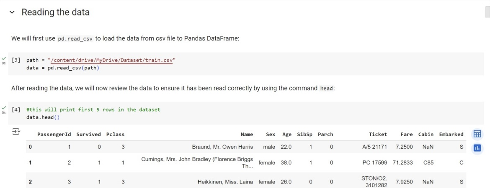
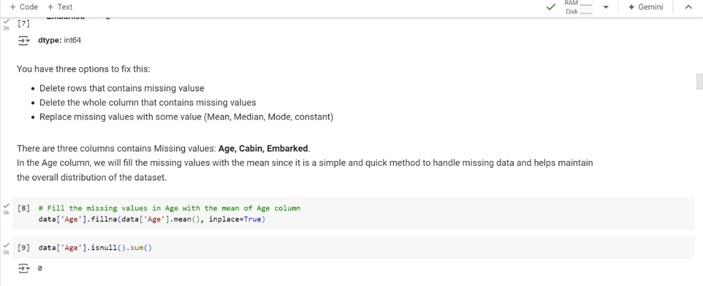
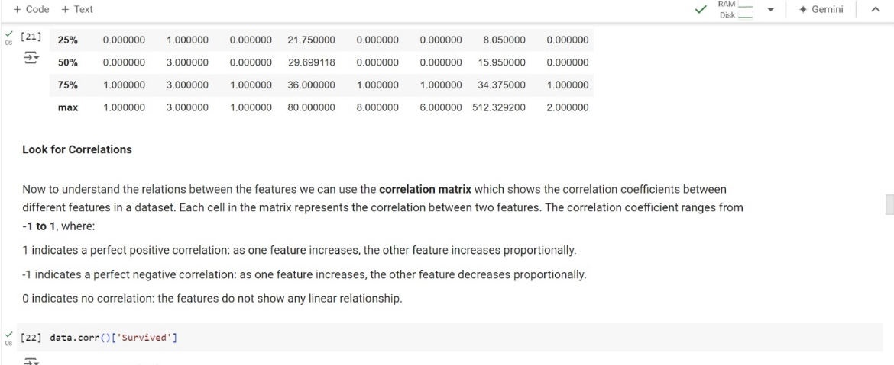

# Titanic - Machine Learning Exploration

Dataset: [Kaggle Titanic Competition](https://www.kaggle.com/competitions/titanic/overview)
link of the my project in the google colab:  [google colab link](https://colab.research.google.com/drive/1juTazBr8aftT40oh1W2_ZWUNQARUV2HW?usp=drive_link)

## Introduction

The Titanic dataset provides information on the passengers who traveled on the Titanic. This project explores different stages of data analysis and machine learning to predict whether a passenger survived the disaster.

## Dependencies

To run the notebook, you need to install the following libraries:

```bash
pip install numpy pandas matplotlib seaborn scikit-learn
```

## Data Loading

We first load the data from a CSV file into a Pandas DataFrame.

```bash
import pandas as pd

# Read the CSV file from Google Drive
data = pd.read_csv('/content/drive/My Drive/train.csv')
data.head()
```

## Data Preprocessing

1. **Review the Data**

```bash
# Number of rows and columns
data.shape

# More information about the dataset
data.info()
```

2. **Dealing with Missing Data**

```bash
# To view the missing values in each column
data.isnull().sum()

# Fill the missing values in Age with the mean of Age column
data['Age'].fillna(data['Age'].mean(), inplace=True)
data['Age'].isnull().sum()

# Drop the Cabin column
data = data.drop(['Cabin'], axis=1)
data.head()

# Fill the missing values in Embarked with the mode of Embarked column
data['Embarked'].fillna(data['Embarked'].mode()[0], inplace=True)
data['Embarked'].isnull().sum()
```

3. **Drop Useless Columns**

```bash
# Drop the PassengerId, Name, and Ticket columns from the dataset
data = data.drop(['PassengerId', 'Name', 'Ticket'], axis=1)
data.head()
```

4. **Encode Categorical Columns**

```bash
# Replace text values with numerical values in Sex and Embarked columns
data.replace({'Sex': {'male': 0, 'female': 1}, 'Embarked': {'S': 0, 'C': 1, 'Q': 2}}, inplace=True)
data.head()
```

5. **Dealing with Duplicates**

```bash
# Check if there are duplicates in the dataset
data.duplicated().sum()

# Drop the duplicates
data = data.drop_duplicates()
```

## Exploratory Data Analysis

1. **Summary Statistics**

```bash
# Summary statistics for numerical columns
data.describe()
```

2. **Correlation Matrix**

```bash
# Correlation matrix
data.corr()['Survived']
```

3. **Data Visualization**

```bash
import seaborn as sns
import matplotlib.pyplot as plt

# Number of people survived and not survived
data['Survived'].value_counts()

# Count plot for 'Survived' column
sns.countplot(x='Survived', data=data)
plt.show()

# Count plot for 'Sex' column
sns.countplot(x='Sex', data=data)
plt.show()

# Count plot for 'Sex' column with 'Survived' hue
sns.countplot(x='Sex', hue='Survived', data=data)
plt.show()

# Count plot for 'Pclass' column with 'Survived' hue
sns.countplot(x='Pclass', hue='Survived', data=data)
plt.show()
```

## Model Building

1. **Separating Features and Target**

```bash
# Separating features and target
X = data.drop(columns=['Survived'], axis=1)
y = data['Survived']
```

2. **Splitting the Data**

```bash
from sklearn.model_selection import train_test_split

# Splitting the data into training and testing data
X_train, X_test, y_train, y_test = train_test_split(X, y, test_size=0.2, random_state=42)
```

3. **Model Training**

```bash
from sklearn.linear_model import LogisticRegression

# Create a Logistic Regression model and train it on the training data
model = LogisticRegression(max_iter=1000)
model.fit(X_train, y_train)
```

## Model Evaluation

```bash
from sklearn.metrics import accuracy_score

# Make predictions on the test data
y_pred = model.predict(X_test)

# Calculate the accuracy of the model
accuracy = accuracy_score(y_test, y_pred)
print(f'Accuracy: {accuracy * 100:.2f}%')
```

## Conclusion

This project demonstrates the essential steps of data preprocessing, exploratory data analysis, and model building using the Titanic dataset. By following these steps, you can gain insights into the data and build a predictive model to estimate the survival of passengers.

## Pictures of the output











